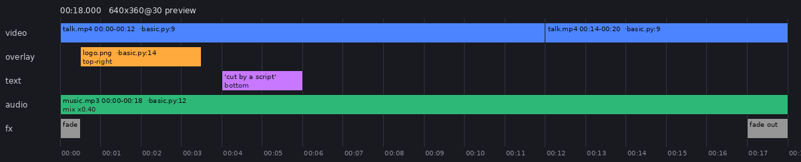
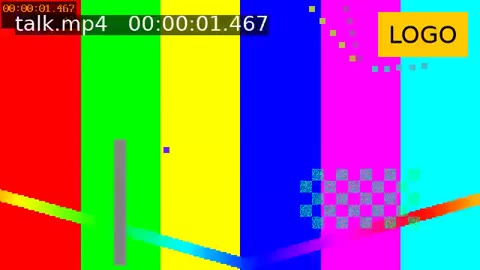
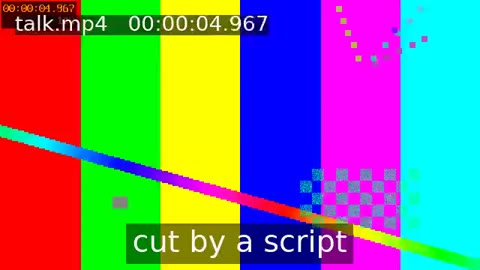
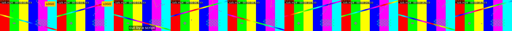
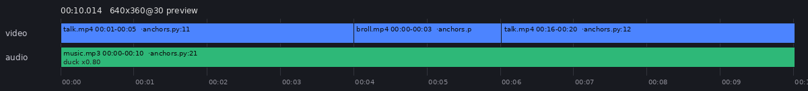
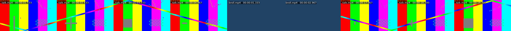
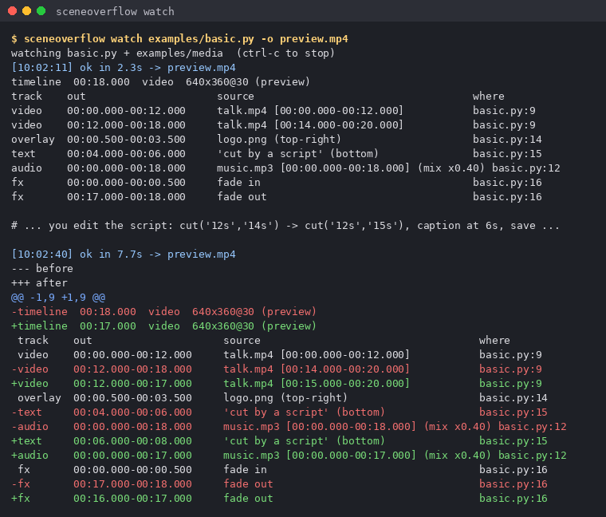
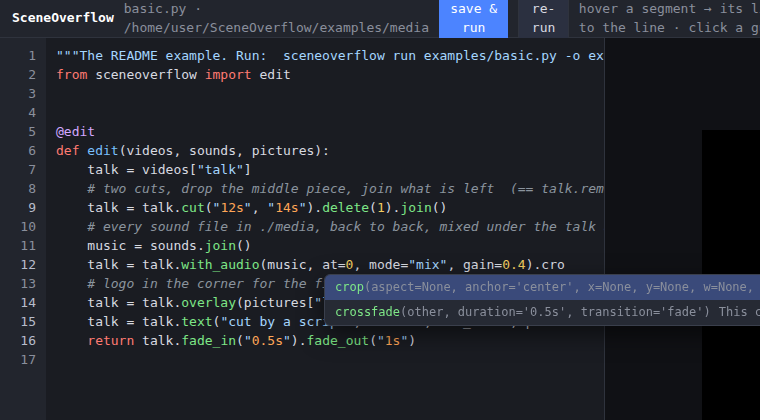
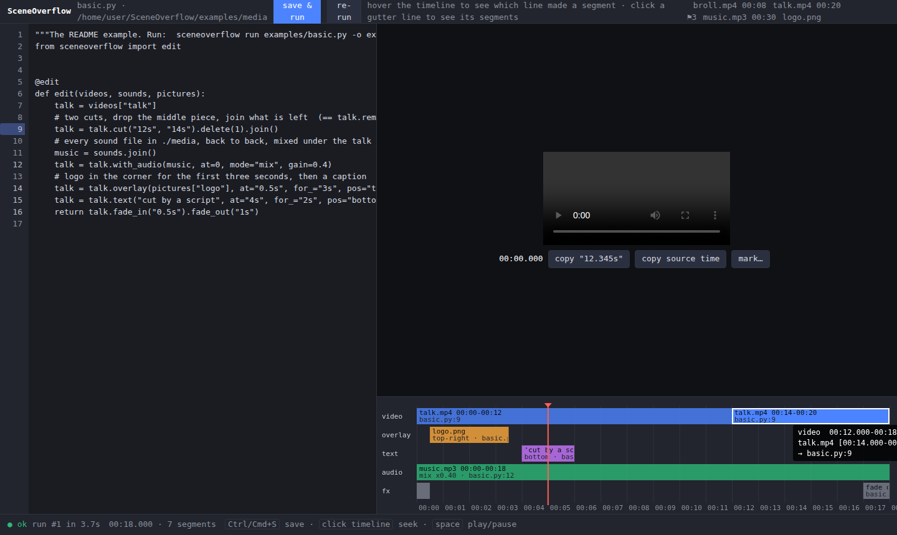

# SceneOverflow

Code-first video editing for programmers and LLM agents. The edit is a Python script.
Times are *anchors* (markers, silences, scene changes, transcript words) instead of
numbers you had to scrub for. Rendering is a cached op graph on top of ffmpeg, so
re-running a script after changing one cut re-renders one segment.

```python
from sceneoverflow import edit

@edit
def edit(videos, sounds, pictures):
    talk = videos["talk"]
    talk = talk.cut("12s", "14s").delete(1).join()          # == talk.remove(("12s", "14s"))
    talk = talk.with_audio(sounds.join(), mode="mix", gain=0.4)
    talk = talk.overlay(pictures["logo"], at="0.5s", for_="3s", pos="top-right")
    talk = talk.text("cut by a script", at="4s", for_="2s", pos="bottom", size=40, box="black@0.5")
    return talk.fade_in("0.5s").fade_out("1s")
```

```
$ sceneoverflow run examples/basic.py -o out.mp4 --png timeline.png
timeline  00:18.000  video  640x360@30 (preview)
track    out                     source                                   where
video    00:00.000-00:12.000     talk.mp4 [00:00.000-00:12.000]           basic.py:9
video    00:12.000-00:18.000     talk.mp4 [00:14.000-00:20.000]           basic.py:9
overlay  00:00.500-00:03.500     logo.png (top-right)                     basic.py:14
text     00:04.000-00:06.000     'cut by a script' (bottom)               basic.py:15
audio    00:00.000-00:18.000     music.mp3 [00:00.000-00:18.000] (mix x0.40) basic.py:12
fx       00:00.000-00:00.500     fade in                                  basic.py:16
fx       00:17.000-00:18.000     fade out                                 basic.py:16

11 rendered, 1 cached, 11.6s -> out.mp4
```



Every segment knows which script line made it (`basic.py:9`). That is the link between
"what I typed" and "what I see".

| `sceneoverflow frame examples/basic.py --at 1.5s` | `--at 5s` |
|---|---|
|  |  |

`sceneoverflow thumbs examples/basic.py` (nine evenly spaced frames; the source clock
jumps from 12s to 14s at the cut):



## Status

Working and tested: the library, the CLI, anchors (markers, silence, scene change,
optional transcript), the Jupyter representation, watch mode, an MCP server for
agents, and the browser studio (editor, preview, timeline, live on save).

What it is not: a motion-graphics engine (see Remotion), or a GUI. What it is honest
about: preview re-renders of cut/join edits take well under a second thanks to
stream-copy on all-intra proxies; anything that touches pixels (overlay, fade, speed,
text, resize) re-encodes its own span and takes seconds.

## Install

Needs `ffmpeg` and `ffprobe` on `PATH` (any recent build; `drawtext` needs libfreetype,
which distro packages have).

```
pip install -e .            # library + CLI, no other dependencies
pip install -e '.[png]'     # + pillow, for timeline PNGs
pip install -e '.[mcp]'     # + MCP server for agents
pip install -e '.[whisper]' # + faster-whisper, for .words()
```

Then `sceneoverflow run examples/basic.py -o out.mp4` (the example media in
`examples/media` is synthetic ffmpeg test footage).

## How it works

1. **Everything is an immutable node.** `edit()` never touches files. Every method returns
   a new clip whose node is `(op, params, inputs)`. The node's content hash names its
   rendered bytes in `.sceneoverflow/render/`. Same hash, same file, no work.
2. **Sources are conformed on import** to a *profile*: fixed resolution (scale + pad),
   constant frame rate, one video stream, one 48 kHz stereo audio stream (silence is
   injected if the file has none), and all-intra H.264. All-intra means every frame is a
   keyframe, so `trim` and `join` are `-c copy` and the concat demuxer. No re-encode.
3. **Preview and final are the same pipeline.** Preview renders from 640x360 proxies.
   `--mode final` renders from full-resolution mezzanines of the originals, then the
   last node is encoded once to a delivery file.
4. **Times are expressions.** `12`, `"12s"`, `"500ms"`, `"1:23.5"`, `"120f"`, a
   `TimeRef` from an anchor, or a `Span`. Anchors do arithmetic:
   `talk.marks["intro_end"] + "0.5s"`.

## Anchors: stop typing seconds

```python
@edit
def edit(videos, sounds, pictures):
    talk, broll = videos["talk"], videos["broll"]
    intro = talk.trim(talk.marks["intro_start"], talk.marks["intro_end"])   # named markers
    outro = talk.trim(talk.marks["outro"])
    first_scene = broll.trim(0, broll.scenes()[0])                          # detected scene change
    body = first_scene.remove(*first_scene.silences(min_len="1s")).speed(1.5)  # detected silence
    return (intro + body + outro).with_audio(sounds["music"], mode="duck", gain=0.8)
```




| Anchor | Where it comes from | Use |
|---|---|---|
| `clip.marks["name"]` | `media/<file>.marks.json`, a git-friendly sidecar | `talk.trim(talk.marks["a"], talk.marks["b"])` |
| `clip.silences(min_len, threshold_db)` | ffmpeg `silencedetect` | `v.remove(*v.silences())` |
| `clip.scenes(threshold)` | ffmpeg scene score | `v.split_at(*v.scenes())` |
| `clip.words()` | faster-whisper, word timestamps (optional extra) | `v.trim(v.words().find("let's begin"))`, `.between(a, b)` |

Anchors on a derived clip are in that clip's own time, so
`talk.trim("2s").silences()` reports positions relative to the trimmed clip.

Setting markers without a GUI:

```
$ sceneoverflow describe examples/media
broll.mp4  video  00:08.000  640x360@30  audio
  silences: 00:03.000-00:05.000
  scenes: 00:04.000
talk.mp4  video  00:20.000  640x360@30  audio
  markers: intro_start=00:01.000, intro_end=00:05.000, outro=00:16.000
music.mp3  audio  00:30.024
logo.png  image  120x60

$ sceneoverflow mark media/talk.mp4 --at 1:02.5 --name outro   # by hand
$ sceneoverflow mark media/talk.mp4 -i                         # opens mpv; type `m outro` while it plays
```

## Compositing

Anything can go on top of anything: a logo on a talk, a talk in the corner of a screen
recording, two takes side by side, a watermark on a still.

```python
screen = videos["screen"]
face = videos["webcam"]
v = screen.pip(face, at="2s", scale=0.25, pos="bottom-right", audio=True)  # face cam from 2s, its mic mixed in
v = v.overlay(pictures["logo"], pos="top-left", width=120, opacity=0.6)     # translucent watermark, whole length
v = v.overlay(videos["broll"], at="10s", for_="4s", pos="center", scale=0.6) # b-roll inset for 4s
compare = videos["take1"].beside(videos["take2"])                            # side by side, letterboxed
card = pictures["frame"].overlay(pictures["logo"], pos="center", scale=0.5)  # picture on picture -> image
```

A video on top starts playing at `at` and runs for its own length unless `for_` says
otherwise. Overlays re-encode their span, so put them on the trimmed piece that needs
them rather than on the whole timeline while iterating.

## Assembling: transitions, titles, freezes, vertical cuts

```python
from sceneoverflow import edit, Sequence

@edit
def edit(videos, sounds, pictures, project):
    intro = project.title("Field notes, day 3", "2.5s", bg="0x101418")
    a, b, c = videos["a"], videos["b"], videos["c"]
    body = Sequence([a, b, c], project).join(transition="dissolve", duration="0.7s")
    body = body.freeze(body.duration - 0.05, "1.5s")          # hold the last frame
    full = (intro + body).normalize().subtitles("media/talk.srt")
    full.render("out.mp4")
    return full.crop("9:16").render("short.mp4")               # same edit, vertical, for phones
```

Transitions are one ffmpeg pass for the whole sequence, whatever its length. `crop`
changes the frame size, so it goes last, or on every piece before a join. `normalize`
targets -16 LUFS by default, which is what podcast and video platforms expect.

## Seeing the edit

**Text and JSON.** `clip.describe()` prints the table above; `clip.to_json()` returns
segments plus the node graph; `sceneoverflow describe script.py --json` does the same
from the shell. This is what you read back after each change, and what an LLM reads.

**Frames and strips.** `clip.frame_at("12.5s")`, `clip.thumbnails(count=8)`, and the
`frame` / `thumbs` commands. Look at a moment instead of watching the whole thing.

**Watch mode.** `sceneoverflow watch script.py -o preview.mp4` re-runs the script in a
subprocess whenever the script or the media changes, rewrites the preview, and prints
the timeline *diff*. Open `preview.mp4` in any player that reloads on change (mpv,
VLC, IINA).



The first run was served from cache (an earlier `run` had rendered it). The second run
re-rendered only the second piece, the concat, and the pixel ops downstream of it; the
`[0s, 12s)` piece, the proxies and the music were cache hits.

**Studio.** `sceneoverflow studio script.py` opens a local page with the script, the
preview and the timeline. Save (Ctrl/Cmd+S) re-runs the script and pushes the new
timeline and video to the page over Server-Sent Events. The link between code and
picture goes both ways: hover a segment and the line that made it lights up in the
gutter; double-click a segment to jump the editor to that line; click a gutter line and
its segments light up on the timeline. The video lane carries frames of the *output*
under the segments. Click the timeline to seek; "insert at cursor" drops the playhead
time into the script as a literal. "copy source time" copies the *source file* time under the playhead
as a literal; "mark…" writes a named marker into the source's sidecar so the script
can say `.marks["name"]` instead. A failed run shows the error and marks the failing
line red. The editor highlights Python and the time literals inside strings, and
completes as you type: methods after a dot (with signature and one-line doc, aware of
whether the receiver is a clip, a sequence, `videos`, or `project`), parameter names
inside a call, file names inside `videos["…"]`, marker names inside `.marks["…"]`,
transition and position names. Tab or Enter accepts, Ctrl+Space opens it. The catalog
comes from the real classes over `/api/catalog`, so it cannot drift.



Stdlib only:
no extra dependency, no build step. A browser without an H.264
decoder (some Linux Chromium builds) gets frame-by-frame stills instead of playback;
seeking and marking still work.



**Your own editor.** The package ships type hints and a `py.typed` marker. Annotate the
edit function and VS Code, PyCharm, and friends complete the whole API:

```python
from sceneoverflow import Clip, MediaList, Project, edit

@edit
def edit(videos: MediaList, sounds: MediaList, pictures: MediaList, project: Project) -> Clip:
    ...
```

`sceneoverflow init` writes the starter that way. `sceneoverflow api --json` prints the
same catalog the studio uses, for tooling of your own.

**Jupyter.** A clip's `_repr_html_` is a player, a thumbnail strip, and the describe
table. See `examples/notebook.ipynb`.

```python
from sceneoverflow import Project
p = Project("examples/media")
p.videos["talk"].remove(("2s", "4s")).with_audio(p.sounds[0], gain=0.3)   # renders inline
```

## Driving it from Claude Code

`sceneoverflow init` in any directory writes a `.mcp.json` that registers the
`sceneoverflow` MCP server, a `CLAUDE.md` with the workflow and the scripting API, a
starter `edit.py`, and `media/`. Start Claude Code there and it can analyse the footage,
write and edit the script, run it, look at frames, set markers, and export, with no
further setup. Open `sceneoverflow studio edit.py` in a browser at the same time: every
save Claude Code makes re-runs in the studio, and the `studio_state` tool tells Claude
what the studio sees, including failing lines.

```
$ sceneoverflow init my-cut && cd my-cut
created  my-cut/edit.py
created  my-cut/.mcp.json
created  my-cut/CLAUDE.md
$ cp ~/footage/*.mp4 media/ && sceneoverflow studio edit.py &
$ claude      # "remove the silences from the first video and put the logo top-left for the first 3 seconds"
```

This repository's own `.mcp.json` points the server at `examples/media`.

## For LLM agents

The whole surface is text in and text out, which is what an agent needs:

- `sceneoverflow describe media/ --json` gives durations, markers, silences, scenes and
  (with `--words`) transcripts.
- `sceneoverflow api` prints the scripting cheat sheet.
- `sceneoverflow run script.py --json out.json` returns the timeline; errors point at
  script lines.
- `sceneoverflow mcp --media ./media` serves the same as MCP tools over stdio:
  `analyze`, `run_edit` (inline code or a path), `frame_at` and `thumbnails` (return
  images, so a vision model can check a moment), `render`, `set_marker`, `studio_state`,
  `api_reference`.

Claude Desktop / Claude Code config:

```json
{ "mcpServers": { "sceneoverflow": { "command": "sceneoverflow", "args": ["mcp", "--media", "/abs/path/media"] } } }
```

The same functions are importable without MCP: `sceneoverflow.agent.analyze(...)`,
`run_edit(code=..., media=...)`, `frame_at(...)`.

## API

Clip (video or audio unless noted):

| Method | Effect |
|---|---|
| `trim(start, end=None)` / `trim(span)` | keep `[start, end)` |
| `split_at(*t)`, `cut(*t)` | pieces between cut points, as a `Sequence` |
| `remove(*spans)`, `keep(*spans)` | delete or keep ranges, joined; spans are `Span` or `(start, end)` |
| `head(d)`, `tail(d)` | first or last `d` |
| `a + b` | concatenate |
| `crossfade(b, d="0.5s", transition="fade")`, `Sequence.join(transition=..., duration=...)` | any ffmpeg xfade transition between cuts; the result is shorter by `d` per cut |
| `freeze(at, d)`, `still(at)`, `loop(n)` | hold a frame, grab a frame as an image, repeat |
| `crop(aspect="9:16", anchor="center")`, `crop(x=, y=, w=, h=)` | vertical or square cuts; changes the frame size, so crop last |
| `normalize(lufs=-16)`, `mute()` | loudness to a broadcast level (EBU R128), or silence |
| `subtitles(srt_or_transcript, style=None)`, `captions()` | burn subtitles from a file, a transcript, or whisper |
| `with_audio(sound, at=0, mode="mix"/"replace"/"duck", gain=1)`, `dub(...)` | add a sound; output keeps the clip's duration |
| `overlay(top, at=0, for_=None, pos="top-right", width=None, scale=None, opacity=1, audio=False)` | image or video on top; `pos` is a name or `(x, y)`; a video top plays from `at`, `audio=True` mixes its sound |
| `pip(video, at=0, pos="bottom-right", scale=0.3)` | picture-in-picture, sized as a fraction of the frame |
| `beside(other)`, `above(other)` | two videos side by side or stacked, audios mixed, letterboxed |
| `text(str, at=0, for_=None, pos="bottom", size=36, color="white", box=None)` | burn a caption |
| `speed(f)`, `fade_in(d)`, `fade_out(d)`, `fade(d)`, `volume(g)`, `resize(w, h)` | what they say |
| `.audio` | the audio track as an audio clip |
| `as_clip(d)` (image) | a still video of duration `d` |
| `overlay(other_image, ...)` (image) | picture on picture, yields an image |
| `marks`, `silences()`, `scenes()`, `words()` | anchors |
| `describe()`, `to_json()`, `timeline_png(path)`, `render(path)`, `preview()`, `frame_at(t)`, `thumbnails()` | output; `render` picks the container from the extension: `.mp4`, `.webm`, `.gif` (`fps=`, `width=`), `.wav`, `.mp3`, `.png` |

Generated clips, from the project (`def edit(videos, sounds, pictures, project)` receives it):
`project.blank("1s", "black")` and `project.title("Chapter 1", "3s", size=56, bg="black")`.

Sequence: `[i]`, `get(i)`, `drop(*i)` / `delete(*i)`, `keep(*i)`, `map(fn)`, `join()`.
`videos`, `sounds`, `pictures` are sequences indexed by number or by (partial) file name.

CLI: `init`, `run`, `describe`, `mark`, `proxy`, `frame`, `thumbs`, `watch`, `studio`, `mcp`, `cache`, `api`.
`sceneoverflow <cmd> -h` for flags.

## Limits, stated plainly

- Cuts are frame-exact on the all-intra intermediates. Audio is re-encoded at cut points
  so it is sample-exact rather than AAC-frame-aligned.
- Variable-frame-rate phone footage is forced to constant frame rate on import so the
  preview and the final agree on where a cut lands.
- `overlay`, `text`, `fade`, `speed`, `resize` re-encode their span. Long spans cost
  seconds. Apply them to short trimmed pieces, not to the whole timeline, when iterating.
- The cache is content addressed and grows without bound. `sceneoverflow cache --clear`.
- `words()` downloads a whisper model on first use and is CPU-bound.
- Interactive marking (`mark -i`) needs `mpv` installed. The studio does the same in
  the browser without it.
- The studio runs the script in a subprocess per change and serves on localhost only.
  It has no auth; do not bind it to a public interface.

## Layout

```
sceneoverflow/
  timing.py       time literals, TimeRef, Span
  graph.py        Node: op, params, inputs, content hash, provenance (script line)
  media.py        ffprobe, Profile, conformance rules
  anchors.py      markers sidecar, silence/scene detection, transcript
  clip.py         Clip, Sequence, MediaList (the public API)
  project.py      Project, @edit, run_script
  describe.py     timeline as text / JSON / PNG
  notebook.py     Jupyter HTML
  render/         cache, ffmpeg wrapper, renderer (one method per op)
  watch.py        watch mode
  studio/         server.py (stdlib HTTP + SSE + Range), catalog.py (API as data), index.html (vanilla JS)
  agent.py        agent tool functions      mcp_server.py   MCP wrapper
  integrations.py .mcp.json + CLAUDE.md writer for `sceneoverflow init`
  cli.py
examples/         basic.py, anchors.py, slideshow.py, notebook.ipynb, media/
tests/            unit tests (no ffmpeg) and integration tests on synthetic clips
DESIGN.md         the original plan and what changed while building it
```

## Development

```
pip install -e '.[dev]'
pytest                       # 70 tests, ~2-3 min; needs ffmpeg (node for the studio JS tests)
pytest -m "not ffmpeg"       # pure-python tests only
```

The integration tests generate their own footage with ffmpeg's `lavfi` sources and
assert output durations with ffprobe, a 100% cache-hit rate on a second run, and that
moving one cut point re-renders exactly two nodes.
